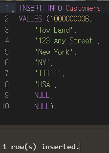

# \`next/image\` Un-configured Host

### 문제상황

<figure><figcaption></figcaption></figure>

과제의 404 페이지를 만들면서 외부 url에서 이미지 소스를 가지고 오는 코드를 작성했다. 그때 발생한 에러.

### 문제원인

<figure><figcaption></figcaption></figure>

SSR인 Nextjs는 서버에서 코드를 실행한 후 브라우저에 화면을 보여주는 과정을 거친다.

이때 외부 소스를 가져오기전 서버에 알려야 한다.&#x20;

<figure><figcaption>
외부 소스 가져와도 되는지 여쭤봐도 되겠습니까?
</figcaption></figure>

<figure><figcaption></figcaption></figure>

이는 악의적인 사용을 방지하기 위한 [**remotePatterns**](https://nextjs.org/docs/app/api-reference/components/image#remotepatterns)이다.

### 문제해결

<figure><figcaption></figcaption></figure>

next.config.js 파일에 이미지를 가져올 url의 정보를 남겨두면 해결된다. 위의 방법처럼 세부적으로 정보를 구분하는 방법도 있고 밑의 방법처럼 넓게 가져가는 방법도 있다.&#x20;

<figure><figcaption></figcaption></figure>

해결완료

